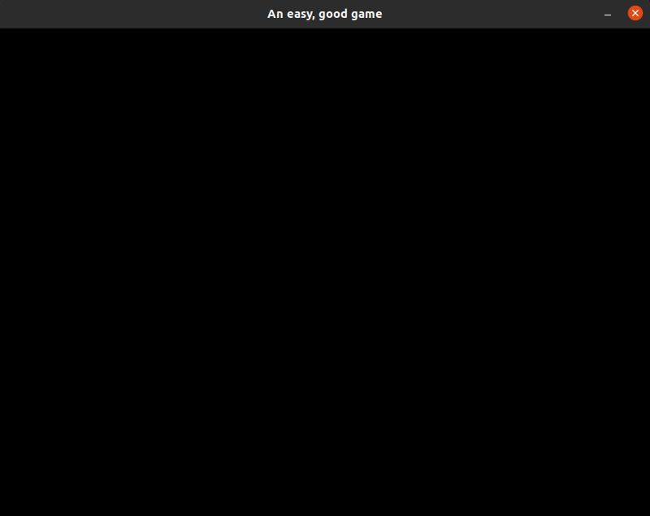
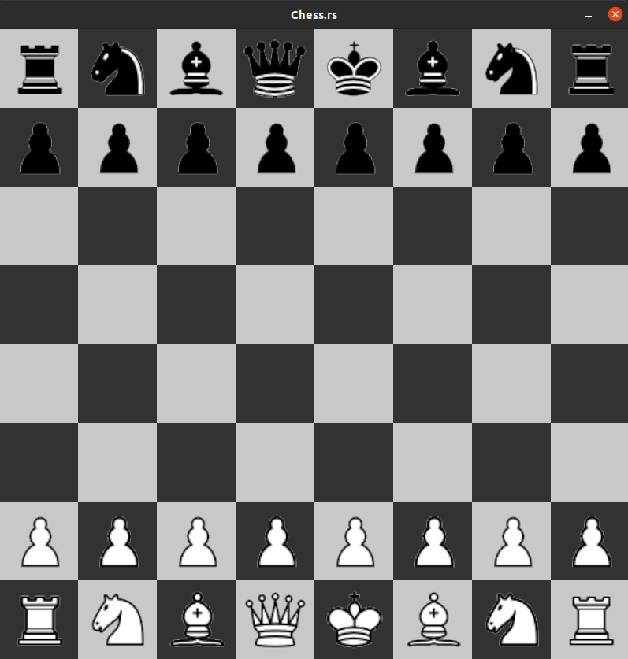

# Part 1: Rendering the GUI
In this part we will learn how we can create a GUI for our game using the ggez crate. We will start
with a blank slate :-

    

And gradually build it up to a decent looking GUI, complete with pieces :-

    

This part is divided into 3 Segments :-
- **1.1 Creating a Window** - In this segment we will create a Window for our GUI, and also a Struct for our Game.
- **1.2 Rendering the Board** - In this segment, we will expand our Main Struct to hold our board and also render the board.
- **1.3 Rendering the Pieces** - In this segment, we will further expand our Main Struct to hold our piece assets (images), a representation of the pieces on the board, and we will render these pieces on the GUI.

Once you are ready, move ahead to `Seg 1.1`.
