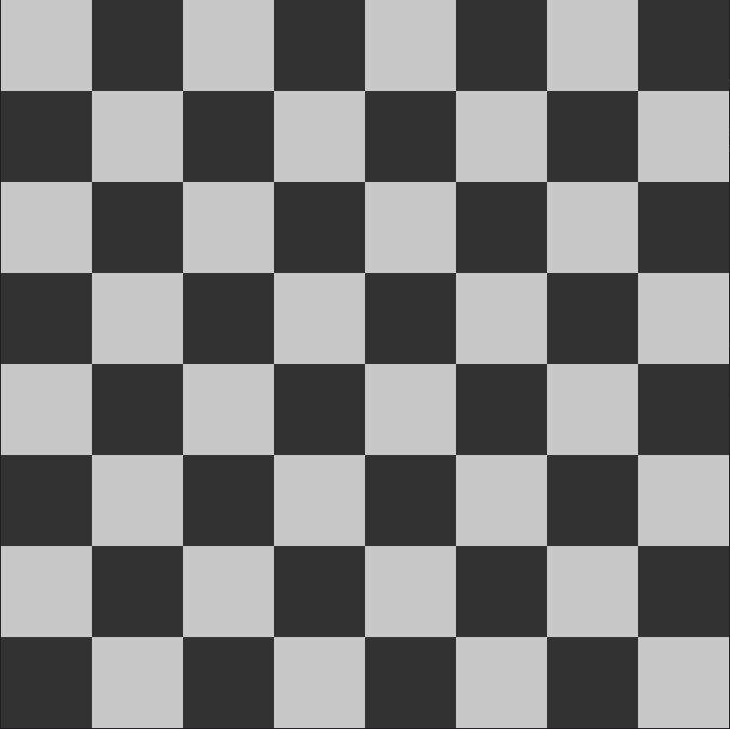

# Segment 1.2: Rendering the Board
We created a blank window in the last Segment. Lets spice it up now by rendering the board shall we?

## 1.2.1 Fixing a Window Size
Before we start rendering anything, remember that the default dimensions for the window are `800x600`?
When divided by 8 along both directions, it would give us a square size of `80x75`. Now I don't 
know bout you but I've always seen square shaped chessboards all my life so the very prospect of
a chessboard having rectangular squares makes me uncomfortable. So lets 'squarify' the window!
<br>
<br>
I'm gonna go with a size of `800x800`. Feel free to go with any size you want as long as it's a
square.<br>
Now that we have fixed a size, lets create a constant for this size outside the `main` function:
```rust
const WIN_SIZE: f32 = 800.0;
```
This is useful since now we can do all our rendering calculations with respect to this one variable,
in which case, if ever we feel dissatisfied with the window size, we can just tweak this constant
without worrying about rewriting any calculations.
<br>
<br>
Now, lets instruct ggez to draw the window in accordance to our preferred dimensions. We'll also
set a cool title for our window how bout that!<br>
Lets start by bringing some stuff into scope again:
```rust
// The WindowMode struct will allow us to set the dimensions
// and with the WindowSetup struct, we'll set the title of the window.
use ggez::conf::{WindowMode, WindowSetup};
```
And then we create instances of these with the required parameters. Both of these structs follow
the builder pattern, much like the `ContextBuilder`.
```rust
fn main() -> GameResult {
    let win_mode = WindowMode::default().dimensions(WIN_SIZE, WIN_SIZE);

    let win_setup = WindowSetup::default().title("My Cool Title");

    // All our other stuff
}
```
And finally, we'll tell our `ContextBuilder` to take these while building the context:
```rust
fn main() -> GameResult {
    // Stuff 

    let (mut ctx, mut event_loop) = ContextBuilder::new("Chess", "Me")
        .window_setup(win_setup)
        .window_mode(win_mode)
        .build()?;

    // Stuff
}
```
Now you can go ahead and `cargo run`. You'll notice that the window looks kind of different now ;)

## 1.2.2 Coding the Board
To render the board, we must have some representation of it. For our representation, we will use
an `8x8` array `[[T; 8]; 8]` where `T` will be ggez's `Color` type which specifies a color. There's
three main advantages to this:
1. Rendering becomes easier since all we have to do is 2D iteration while rendering.
2. In subsequent parts, we will implement square highlighting for piece moves, which would be trivial
with a board representation like this.
3. It's overall much simpler to understand (as is intended by this tutorial).  
<br>
For this, lets start by bringing the required types into scope:  
```rust
use ggez::graphics::Color;
```  
The colors for black and white squares that we use in this implementation will just be two differing
shades of Gray, which can be represented as a single Grayscale intensity value (You can change
this if you want of course). Lets create a couple of constants for this:  
```rust
const WHITE_COLOR: u8 = 200;
const BLACK_COLOR: u8 = 50;
```  
###### We won't use 0 and 255 respectively since the pieces used in this implementation will be black and white, and we wouldn't want them to get camouflaged now would we?
Lets add some fields to our main Struct:  
```rust
struct Game {
    // This field will represent our chess board
    board: [[Color; 8]; 8],
}
```  
And modify the new method to reflect the change:  
```rust
impl Game {
    fn new() -> Self {
        Self {
            // We use the from_rgb method and feed in our 'WHITE_COLOR' constant for
            // all three values since identical values of R, G and B result in a
            // grayscale color which is what we want.
            //
            // Also the Color type implements the 'Copy' trait so we won't have a
            // problem initializing the array this way.
            board: [[Color::from_rgb(WHITE_COLOR, WHITE_COLOR, WHITE_COLOR); 8]; 8]
        }
    }
}
```  
aaaaaaand looks like we're done.
<br>
<br>
BUT WAIT! all we did was make all of the squares white. We need a checkerboard pattern to make it
look like an actual chessboard! so lets do that!
<br>
Now, we could write the logic for this in the `new` method. However, we might wanna reset the board
quite a few times in the future, hence lets create a new method. We'll call this `reset_board`:  
```rust
impl Game {
    // Stuff above
    
    fn reset_board(&mut self) {
        for y 0..8 {
            let row_even = y % 2 == 0;

            for x in 0..8 {
                let col_even = x % 2 == 0;

                self.board[y][x] = if row_even == col_even {
                    Color::from_rgb(WHITE_COLOR, WHITE_COLOR, WHITE_COLOR)
                } else {
                    Color::from_rgb(BLACK_COLOR, BLACK_COLOR, BLACK_COLOR)
                };
            }
        }
    }

    // Stuff below
}
```  
And there we have it!  
.  
.  
.  
I'm just kidding don't worry, I ain't leaving you without an explanation XD
<br>
Take a look at this chessboard.
<p align="center">
    
</p>
In particular, take a look at how the white squares are positioned. Try assigning a co-ordinate value
to each white square. Remember, the indexing starts from 0 and the positioning starts from the top
left. On assigning a co-ordinate value to each white square, we get a pattern like so:  
```
(0,0)     (0,2)     (0,4)     (0,6)

     (1,1)     (1,3)     (1,5)     (1,7)

(2,0)     (2,2)     (2,4)     (2,6)

     (3,1)     (3,3)     (3,5)     (3,7)

(4,0)     (4,2)     (4,4)     (4,6)

     (5,1)     (5,3)     (5,5)     (5,7)

(6,0)     (6,2)     (6,4)     (6,6)

     (7,1)     (7,3)     (7,5)     (7,7)
```  
Notice anything yet? If you did then that's great!
<br>
From the co-ordinate diagram it is clear that a square is white if and only if its x and y
co-ordinates have the same 'evenness' i.e they're either both even or both odd. All the other
squares are black.
<br>
This logic is all that was applied in the code we just wrote (see it for yourself!).

## 1.2.3 Rendering the Board
At this point we are more than ready to render our beautiful chessboard. We will finally be using
the `draw` method who's probably been lonely all this time, altho nothing compared to the poor
`update` method :'( (Refer to `1.1.2` for context)
<br>
As always, we begin by bringing the required stuff into context:  
```rust
// Yep, that's a lot.
use ggez::graphics::{self, Color, DrawMode, DrawParam, Mesh, Rect};
```  
Rendering the board is basically a 3 step process :-
- Clear the Screen
- Draw the board
- Present the new screen
<br>
And here's the code for that:  
```rust
impl EventHandler for Game {
    fn draw(&mut self, ctx: &mut Context) -> GameResult<()> {
        // Initially we clear the screen using the 'graphics::clear' method.
        // We give it a mutable reference to our Context and a color to fill
        // the screen with.
        graphics::clear(ctx, Color::from_rgb(0, 0, 0));

        // We first get the size of the squares.
        let sq_size = (WIN_SIZE / 8.0) as i32;

        // Then we iterate over every square of the board
        for (y, row) in self.board.iter().enumerate() {
            for (x, sq) in row.iter().enumerate() {
                // Here we get the position of the top left corner
                // of the square.
                let x_pos = x as i32 * sq_size;
                let y_pos = y as i32 * sq_size;

                // We create a new 'Rect' that represents our square.
                // the 'new_i32' method for 'Rect' takes the co-ordinates of
                // the top left corner of the rectangle and the width and
                // height of the rectangle.
                let rect = Rect::new_i32(x_pos, y_pos, sq_size, sq_size);

                // We have our square now. However, it ain't gonna draw itself.
                // We need to first create a 'Mesh' with our square.
                // the 'new_rectangle' method for 'Mesh' takes a mutable reference
                // to the context, a 'DrawMode', our rectangle, and the color.
                // It returns a GameResult which we unwrap using the '?' operator.
                let mesh = Mesh::new_rectangle(ctx, DrawMode::fill(), rect, *sq)?;

                // And now that we have our mesh, we draw it using the 'graphics::draw'
                // method. We feed in a mutable reference to the Context, a reference to
                // the mesh and a 'DrawParam' with default value. We unwrap the returned
                // GameResult with '?' for error handling purposes.
                graphics::draw(ctx, &mesh, DrawParam::default())?;
            }
        }

        // And now we present the newly rendered board to the user!
        // Notice there's no semicolon at the end. the 'graphics::present'
        // method returns a GameResult which we return outta the function.
        graphics::present(ctx)
    }
}
```  
And there we have it! Just do `cargo run` and enjoy the sight of your beautiful chessboard!
<br>
We are pretty much done here, altho there is something that needs to be addressed.

## 1.2.4 Optimizing the Rendering Process
We have the rendering of the board up and running but we have a small problem.
<br>
Altho, rather than a problem, it's more like unnecessary overhead.
<br>
The thing is, the `draw` function in which we wrote the code for rendering the board is running
continuously. That is, it is repeatedly refreashing the screen and re-rendering the board. However
we don't really need it to do that over and over again. It's perfectly fine for the rendering logic
to run once and then wait for some input from the user before running again since the environment we have is static (if
it was dynamic, we would be making use of the lonely `update` method).
<br>
Those of you with low end PCs might have perceived a noticeable drop in performance. This is due to
the draw function being called again and again.
<br>
<br>
To solve this, we will create a struct variable `needs_draw` which will be a boolean. The idea is that
the draw function will perform the rendering logic only when this variable is `true`, and it will set
it back to false again once it's done with the rendering logic. This way, we can just set 
the variable to `true` whenever we want to refresh the screen. It will refresh the screen once and stop there.
<br>
<br>
We begin by tweaking the struct and the `new` method:  
```rust
struct Game {
    // Other fields

    // This variable will be a boolean
    need_draw: bool,
}


impl Game {
    fn new() -> Self {
        // Stuff above

        Self {
            // Other fields

            // We will set this to 'true' initially since we want the board to be drawn
            // when the application starts.
            needs_draw: true,
        }
    }
}
```  
And then we add the logic to the `draw` method:  
```rust
impl EventHandler for Game {
    fn draw(&mut self, ctx: &mut Context) -> GameResult<()> {
        // if the variable is 'false', return from the function.
        if !self.needs_draw {
            return Ok(());
        }

        // Rendering Logic here

        // Set the variable to 'false' so the loop won't run again.
        self.needs_draw = false;

        graphics::present(ctx)
    }
}
```  
And done! Now the `draw` function won't be called over and over again for nothing.
<br>
<br>
And that's about it! You're now ready to move to `Segment 1.3` and start rendering the pieces. See ya there!

## 1.2.5 Committing our Changes
Come on, don't tell me you forgot again!  
<br>
```
git add src/main.rs

git commit -m "Added board rendering logic and optimized the drawing"
```  
