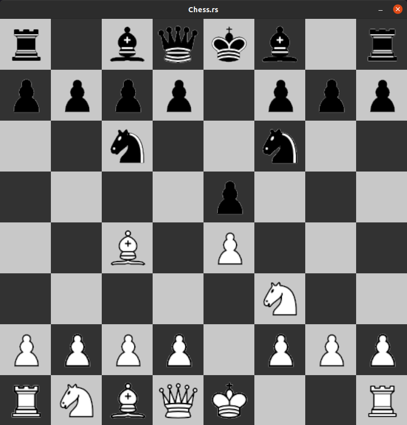

# Make Your Own Chess Game (in Rust)
Chess is one of the world's most popular boardgames. Two players battle it out on an 8x8 grid
with their troops; Attacking, Scheming and trying to outsmart their opponent.
Even if you haven't played it,
you must have heard of it. I mean, if not then why would you be here? right?
 
In this series of.. uhh idk what to call it.. Readmes? Anyways, in this series we will learn how
to implement Chess in the best programming language in the world, which is Rust!
 
The final product will look like something along the lines of this :-

    

### Why Chess?
Implementing Chess is a great way to test your analytical and programming skills in any programming
language no matter whether you're a beginner or a full on Senior Developer. Not to mention it's
super fun to implement!
 
 
Keeping this in mind, I would suggest you to try to implement Chess on your own once if you've never tried it before. Who knows, maybe
you don't even need this tutorial. However, if you feel stuck or lost, if you feel like you don't
understand how to do something and want some assistance/insight, or if you're just looking for
something interesting to read and code
along with, you have come to the right place passenger. Climb in back and we'll be off!

### Structure of the Tutorial
The tutorial is divided into parts, each part having its own folder and its own Readme.
The Readme will have Sections which will contain detailed explanations of the concepts being implemented
along with code blocks.
Additionally, each Part will have two Rust Source files.
- `code.rs` - This file will contain all the 'new' code that has been added in the part.
- `total.rs` - This file will contain all of the code up till the current part + the code added in the current part.
 
 
Some parts may be further divided into 'Segments' with each Segment having its own Folder, Readme and
Source Files. In this case, the Readme of the Part will only contain a higher level explanation of the concept
along with a summary of the Segments, while the Segments will dive more into depth. Furthermore, the
`code.rs` file of the Part will be omitted and the `total.rs` file will contain the code up till that
part + new code from all the segments.
